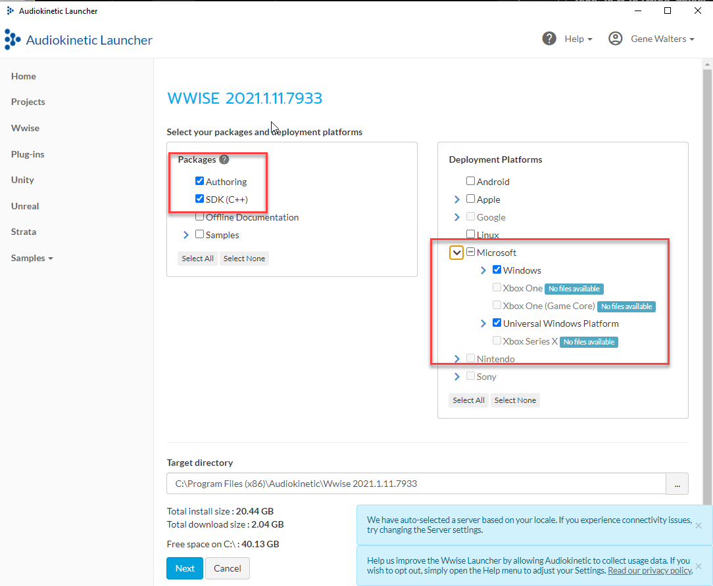
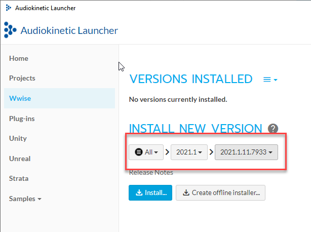

# Packaged MultiplayerSample Builds
To make relocatable client and server builds for the MultiplayerSample, we recommend making packaged builds. These package builds will contain the Game or Server Launcher and the bundled assets needed to run the launcher outside of the developer environment.

You can make both release packaged builds or profile packaged builds, see https://www.o3de.org/docs/user-guide/packaging/windows-release-builds/.

The guide below covers how to make profile packaged builds which are very useful for early sharing and play testing.

## Windows Profile PAK Setup


### Install WWise
Go to https://www.audiokinetic.com/download/, create a login, log in, and download the installer. WWise is needed to process and package audio assets in the project.



Inside the installer select the version to use.  Install version **2021.1.11.7933**, select both Authoring and SDK, Microsoft platform.



> REBOOT (or logout / login). Otherwise, the environment settings won't get picked up for any builds in Visual Studio. They will only apply to command-line builds, and only for any command-line windows that have been opened after the installer finishes.

### Build profile build and process assets

Build and run MPS as per the [README.md](../README.md) and ensure all assets are built.

### Test the profile build

* Open the game in editor
    * load `NewStarBase` level
    * Verify that game can launch and connect to local server from editor
* Validate local game launcher can connect to local server

### Build AssetBuilder

You will need to build the [AssetBundler](https://development--o3deorg.netlify.app/docs/user-guide/packaging/asset-bundler/overview/) tool if not built.

For example:
```shell
cmake --build build\windows --target AssetBundler --config profile -- /m /nologo
```

### Reprocess MultiplayerSample_Dependencies.xml

> Step only required if  https://github.com/o3de/o3de/issues/15338 is still open.

* Run AssetProcessor 
* Open the Assets tab
* Open the Product Assets tab
* Search for `multiplayersample_dependencies.xml`, right-click on it, and choose "Reprocess Source Asset"
* Close AssetProcessor

### Build monolithic game

Build a second version of the executables as monolithic pak builds.

``` shell
// Create build files for a monolithic build that also disables all user/project registry settings overrides
cmake -B build\windows_mono -S . -G "Visual Studio 16" -DLY_3RDPARTY_PATH=c:\your\path\to\3rdParty -DLY_MONOLITHIC_GAME=1 -DALLOW_SETTINGS_REGISTRY_DEVELOPMENT_OVERRIDES=0

// Build the profile versions of all the executables
cmake --build build\windows_mono --target MultiplayerSample.GameLauncher MultiplayerSample.ServerLauncher MultiplayerSample.UnifiedLauncher --config profile -- /m /nologo
```

The outputs in windows_mono\bin\profile can be copied and run anywhere, once the pak files are put in the proper location.


### Bundle Content

Run the  AssetBundler

```
build\windows\bin\profile\AssetBundler.exe --project-path="c:\your\path\to\o3de-multiplayersample"
```

Follow steps for "Create a bundle for game assets", "Create a bundle for engine assets" and "Add bundles to the release game layout" from https://www.o3de.org/docs/user-guide/packaging/asset-bundler/bundle-assets-for-release/

* The "default seed lists" choice should choose all but 4 seed lists to make the `engine_pc.pak`
* The other 4 seed lists should all get selected to make the `game_pc.pak`

> It's important to make sure that the bootstrap.game.profile.setreg file has been added to one of the seed files. (also add debug if you want to support debug builds)

### Create the Launcher Zip file

Use the following .bat file or equivalent copy steps to create a directory with the launchers in it:
```shell
rem Use this by calling 'make_release D:\my\output\dir' to make a release directory
mkdir %1
mkdir %1\Cache
mkdir %1\Cache\pc
mkdir %1\Gems
mkdir %1\Gems\AWSCore
 
rem Copy the pak files
copy c:\your\path\to\o3de-multiplayersample\AssetBundling\Bundles\*.pak %1\Cache\pc
 
rem Copy the executables and DLLs
copy c:\your\path\to\o3de-multiplayersample\build\windows_mono\bin\profile\*.* %1
 
rem Copy the AWSCore files?
copy c:\your\path\to\o3de-multiplayersample\build\windows_mono\bin\profile\Gems\AWSCore\*.* %1\Gems\AWSCore
 
rem Copy the launch_client / launch_server files
copy c:\your\path\to\o3de-multiplayersample\launch_*.* %1
 
rem Copy the PIX DLLs if PIX is enabled in the build
:: copy D:\ly\lyengine\3rdParty\WinPixEventRuntime\bin\x64 %1
```

It's recommended during testing you track the commit IDs used from o3de, o3de-multiplayersample, and o3de-multiplayersample-assets to have as reference. 
You can add this as .txt file in the build folder.

Zip up the directory before running it to make sure the zip is "pure" without any logs or artifacts.

### Run the final build to verify it

```shell
MultiplayerSample.ServerLauncher.exe --console-command-file=launch_server.cfg --rhi=null -NullRenderer -bg_ConnectToAssetProcessor=0 -sys_PakPriority=2 -sv_terminateOnPlayerExit=false
MultiplayerSample.GameLauncher.exe --console-command-file=launch_client.cfg -bg_ConnectToAssetProcessor=0 -sys_PakPriority=2
```

After running, check the output logs to verify there aren't any crashes, missing assets, etc. If any assets are missing, go back to the AssetBundler step, add the assets, and repeat.

### Run the Launchers from Visual Studio
Rename the o3de-multiplayersample/Cache/pc folder to pc-loose
Create an o3de-multiplayersample/Cache/pc folder
Copy the engine_pc.pak and game_pc.pak files into that folder
Use the same command-line parameters as above


## Linux profile packaged builds

Instructions for Linux are similar to Windows instructions above. All examples are Ubuntu 22.04 which is the primary Linux platform for O3DE. See https://www.o3de.org/docs/welcome-guide/requirements/ for more details.

## Install WWise
See instructions above but install Wwise for Linux Ubuntu

### Build profile build and process assets

Build and run MPS as per the [README_LINUX.md](../README_LINUX.md) and ensure all assets are built.