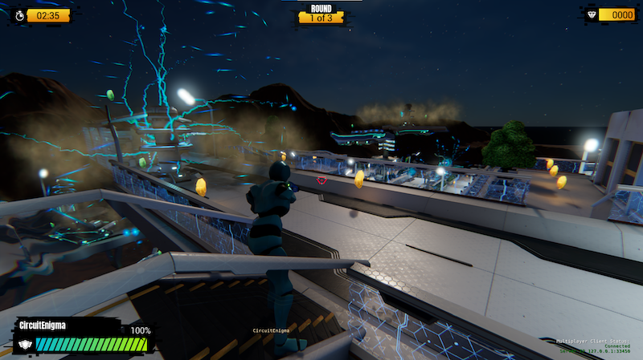

# Release Notes for MultiplayerSample

## O3DE 2305 Release

2305 is the base version of the game. It is expected to be functional and support up to 10 players. 

### Testing Notes

| Platform         | In Editor    | Profile PAKs | Release + PAKs |
|------------------|--------------|--------------|----------------|
| Windows          | yes - stable | yes - stable | no             |
| Ubuntu           | yes -stable  | no           | no             |
| Mobile Platforms | n/a          | no           | no             |

MPS was tested using both LAN hosted servers and using AWS EC2 for remote server testing.

### Known Issues

There are some notable known issues:

* On Linux there's a problem with some actor motionsets appearing to have root motion applied: https://github.com/o3de/o3de-multiplayersample/issues/315
* For the ServerLauncher there are serialization warnings in the log relating to PopcornFX which are harmless, as PopcornFX is ignored on the Server by design.
* The game has fixed support for 10 players: https://github.com/o3de/o3de-multiplayersample/issues/351. More than 10 players can join the server, but they will not be able to play the game (nor show correctly in UX).
* Opening ImGUI can block player input: https://github.com/o3de/o3de-multiplayersample/issues/353

For the complete and up-to-date list of issues, please see [MPS issues](https://github.com/o3de/o3de-multiplayersample/issues?q=is%3Aissue+is%3Aopen+label%3Akind%2Fbug) and [MPS SampleAssets issue](https://github.com/o3de/o3de-multiplayersample-assets/issues).

