# PopcornFX Assets - O3DE Multiplayer Sample

The Multiplayer Sample includes nine visual FX assets created with PopcornFX. This README documents the these FX assets so that you can customize them or deconstruct them to learn how to build PopcornFX assets of your own.

The PopcornFX project containing all the source assets can be found in the following directory:
`<multiplayer-sample-root>/PopcornFX/PopcornProject.pkproj`.

## Requirements

The **PopcornFX** Gem depends on the following additional Gems:

* **Atom**
* **Script Canvas**
* **EMotionFX**
* **PhysX**
* **LyShine**
* **Starting Point Input**

## General information

Some of the FX are split into multiple parts (for example, Blast, Projectile, and Explosion). Splitting the FX makes it easier to integrate the FX into varied gameplay scenarios.

Many of the FX have a **Color Intensity** property that you can modify to adjust the emissive effect. The emissive effect requires that the **PostFX Layer** and **Bloom** components are added to the scene.

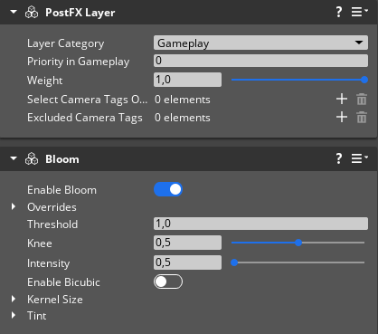

## Armor Power Up

The Armor Power Up is not a particle system, but rather mesh and shader asset.

The effect is triggered by the **Slider** property on the `ArmorPowerUp.material`.

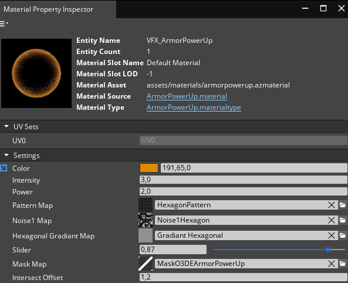

The `Script_ArmorPowerUp.scriptcanvas` is a test Script Canvas that loops the Armor Power Up FX.

## Bubble Gun

The Bubble Gun VFX is split into the following three parts:

| **Blast** | **Projectile** | **Explosion** |
| - | - | - |
|  |  |  |

The following properties are available to adjust the look of Bubble Gun VFX:

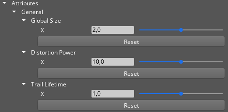

| Property | Description |
| :-- | :-- |
| **Global Scale** | Scales the size of the VFX. |
| **Distortion Power** | Amount of distortion effect. |
| **Trail Lifetime** | The lifetime of the smoke. Higher values increase the length of the trail. |

## Defense Turret

The Defense Turret VFX is split into the following three parts:

| **Blast** | **Projectile** | **Explosion** |
| - | - | - |
| 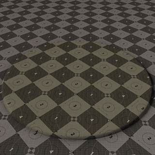 |  | 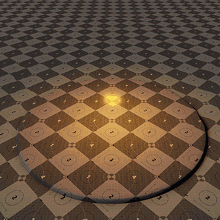 |

The following properties are available to adjust the look of the Defense Turret VFX:

| Property | Description |
| :-- | :-- |
| **Color 1, Color 2** | Sets the color and alpha values for the VFX. |
| **Global Scale** | Scales the size of the VFX. |
| **Color Intensity** | Sets the intensity of the emissive effect. |

The Explosion FX needs to be oriented with the **Impact Normal** attribute. You can set this up in Script Canvas.

## Energy Ball Trap

The Energy Ball Trap VFX is split into the following three parts:

**Build up**
**Projectile**
**Explosion**

 

The following properties are available to adjust the look of the Energy Ball Trap VFX:

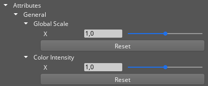

| Property | Description |
| :-- | :-- |
| **Global Scale** | Scales the size of the VFX. |
| **Color Intensity** | Sets the intensity of the emissive effect. |

For a smooth transition between the three parts, each part needs to start at the same frame the previous part ends. You can trigger the FX in Script Canvas.

## Energy Collector

The Energy Collector is a simple single emitter. It just needs to be placed accurately on an entity and triggered by Script Canvas.

 

The following properties are available to adjust the look of Energy Collector VFX:

| Property | Description |
| :-- | :-- |
| **Color 1, Color 2** | Sets the color and alpha values for the VFX. |
| **Distortion Power** | Sets the amount of the distortion effect. |
| **Global Scale** | Scales the size of the VFX. |

## Jump Pad

The Jump Pad is a simple single emitter. It just needs to be placed accurately in a level and triggered by Script Canvas.

 

The following properties are available to adjust the look of Energy Collector VFX:

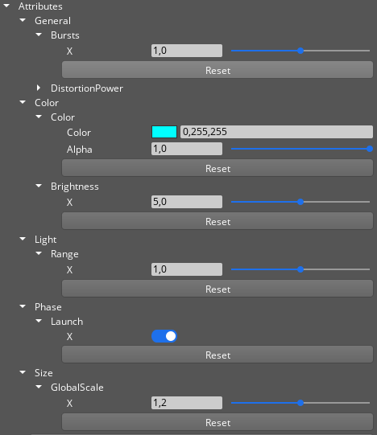

| Property | Description |
| :-- | :-- |
| **Burst** | Sets duration of the launch. |
| **Color** | Sets the color and alpha of the VFX. |
| **Brightness** | Scales the glow effect of the VFX. |
| **Light Range** | Sets the reach of the glow effect of the VFX. |
| **Global Size** | Scales the size of the VFX. |

To trigger the Jump Pad VFX, the **Launch** property must be toggled. It doesn't matter if the boolean is true or false. The VFX will trigger if the state of the **Launch** property changes.

 

The test Script Canvas `script_VFXTestTriggerJumpPad` loops the Jump Pad VFX.

## Laser Gun

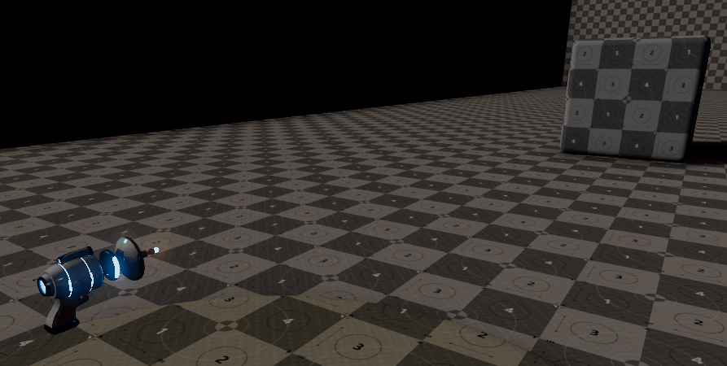 

The Laser Gun VFX is split into the following three parts:

| **Blast** | **Ray** | **Explosion** |
| - | - | - |
| 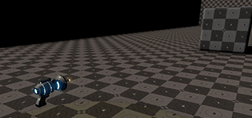 | 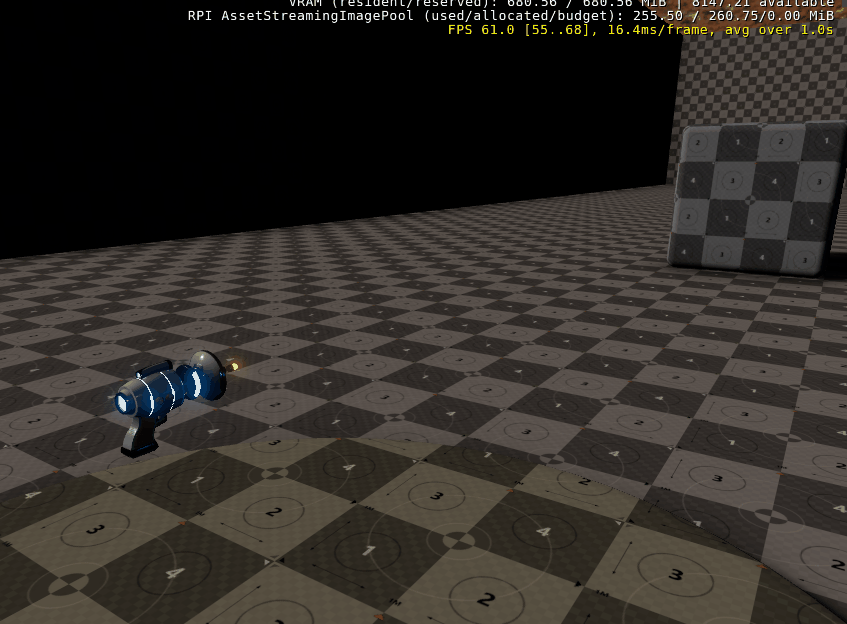 |  |

The following properties are available to adjust the look of Laser Gun VFX:

| Property | Description |
| :-- | :-- |
| **Color 1, Color 2** | Sets the color and alpha values for the VFX. |
| **Global Size** | Scales the size of the VFX. |
| **Max Length** | Sets the distance at which the explosion occurs if the **Hit Position** is further away than the **Max Length** value. This avoids spawning too many particles if the **Hit Position** is too far away. |
| **Laser Lifetime** | Sets the lifespan of the ray. |
| **Hit Position** | Sets the world position of the end of the ray. |
| **Hit Normal** | The normal of the impact surface that sets the orientation of the explosion. |
| **Distortion Power** | Sets the amount of the distortion effect. |

## Malfunctioning Shield Generator

The Malfunctioning Shield Generator VFX is split into the following three parts:

**Idle**
**Build up**
**Explosion**

For a smooth transition between the three parts, each part needs to start at the same frame the previous part ends. You can trigger the FX in Script Canvas.

 

The following properties are available to adjust the look of Malfunctioning Shield Generator VFX:

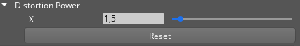
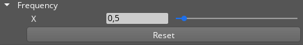 

| Property | Description |
| :-- | :-- |
| **Distortion Power** | Sets the amount of distortion effect on the **Explosion** emitter. |
| **Frequency** | Sets an approximate time (in seconds) between two electric bursts on the **Idle** emitter. |

## Speed Power Up

The Speed Power Up VFX is one emitter but three stages that are triggered automatically.

**Build Up**
**Idle**
**Fade Out**

 

The following properties are available to adjust the look of Speed Power Up VFX:

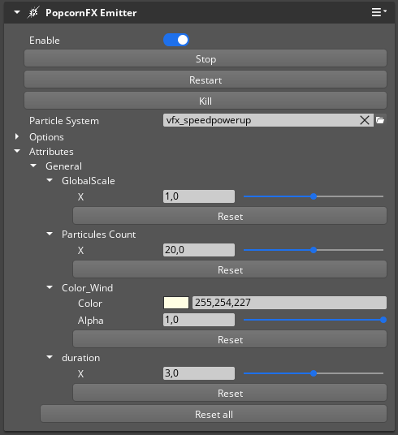 

| Property | Description |
| :-- | :-- |
| **Global Scale** | Scales the size of the VFX. |
| **Particles Count** | Sets the trail particle count. Higher values give the vFX a more opaque look. |
| **Color Wind** | Sets the color and alpha of the wind trail. |
| **Duration** | Sets an approximate time (in seconds) for the **Idle** stage of the VFX. |
