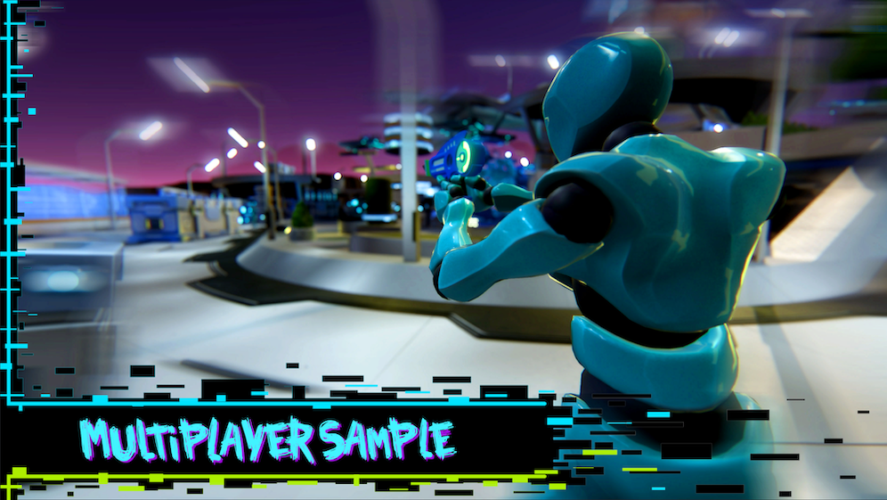

# MultiplayerSample Project



The MultiplayerSample Project is a third-person multiplayer game built on Open 3D Engine (O3DE), where robots battle one another for dominance in an under construction, multi-tiered starbase.

<span style="background-color:#4F3C3C">**NOTE:** For Linux setup, see the guide in [README_LINUX.md](README_LINUX.md)</span>

## Game overview

In this sample, players compete for the highest score to win. Over a series of rounds, players race around the starbase to collect gems and rack up points. Each player is armed with a laser pistol and protected by a shield. Taking damage from laser blasts depletes the player's shield. Once the shield is depleted, the player respawns at the cost of some of their collected gems.

Do you risk it all to win?

Game features:

* 3rd-person character setup
* Weapons (laser pistols) with a reticle, projectile, and visual effects
* Environmental dangers, including energy cannons and malfunctioning shield towers
* Jump pads to boost players high into the air
* A configurable number of rounds (default: 3 rounds)
* Configurable gem spawning patterns per round to drive player exploration
* Support for 1 to 15 players
* Rich sounds and visual effects support
* Teleporters to aid player exploration and to demonstrate moving players.
* Many points of extensibility

> A player can win the whole game early by reaching a score of 400. See the [Gameplay Configuration](Documentation/GamplayConfiguration.md) docs.

### Player controls

* Move using: **W,A,S,D**
* Speed toggle (sprint or walk): Tap **Shift**
* Jump: **Space**
* Look around: **Mouse drag**
* Fire primary weapon: **Left mouse button**
* See scoreboard: Hold **Tab**
* Open game menu: **Esc**
* Draw/holster active weapon: **E**

## Prerequisites

This repository uses **Git LFS** to store large binary files. A GitHub personal access token is required to authenticate with the Git LFS service. You can setup your personal access token and credential manager with the following steps:

1. Create a Git Personal Access Token. Your personal access token credentials are required for authentication when you clone the repository. For more information, refer to [Create a personal access token with the \'repo\' scope.](https://docs.github.com/en/github/authenticating-to-github/creating-a-personal-access-token)

2. Verify you have a [credential manager installed and configured](https://github.com/microsoft/Git-Credential-Manager-Core). Recent versions of Git install a credential manager so that your credentials are stored and supplied automatically when required.

## Conventions used in these instructions

These instructions use the following installation paths. Be sure to substitute your local installation paths:

* O3DE installation root: `C:/o3de/`
* O3DE 3rd-party packages root: `C:/o3de-packages/`

## Step 1: Clone the repository

<span style="background-color:#4F3C3C">**NOTE:** You can clone the project to any local directory. If you clone the project inside an existing Git repository directory (for example, the directory that contains your local O3DE engine repository) you should add the o3de-multiplayersample project directory to the Git exclude file for the existing Git repository.</span>

### Option #1 (Recommended) - Cloning into a directory outside the engine repository directory

1. In a terminal, `cd` to the local directory where you'd like to clone the project, for example:

   ```shell
   mkdir C:/my-o3de-projects
   cd C:/my-o3de-projects
   ```

2. Clone the project.

   ```shell
   git clone https://github.com/o3de/o3de-multiplayersample.git
   Cloning into 'o3de-multiplayersample'...
   ```

3. Clone the assets. In this example the assets are cloned beside the multiplayersample project.

   ```shell
   git clone https://github.com/o3de/o3de-multiplayersample-assets.git
   Cloning into 'o3de-multiplayersample-assets'...
   ```

4. From inside your clone of o3de-multiplayersample-assets, update the submodules. This step adds some required content such as the PopcornFX Gem.

   ```shell
   cd o3de-multiplayersample-assets
   git submodule update --init --recursive
   ```

### Option #2 - Cloning into the engine repository directory

1. Clone the project into a directory named 'o3de-multiplayersample' in your existing engine repository directory.

   ```shell
   git clone https://github.com/o3de/o3de-multiplayersample.git C:/o3de/o3de-multiplayersample
   Cloning into 'o3de-multiplayersample'...
   ```

1. Clone the asset Gems into a directory named 'o3de-multiplayersample-assets' in your existing engine Gems directory.

   ```shell
   git clone https://github.com/o3de/o3de-multiplayersample-assets.git C:/o3de/gems/o3de-multiplayersample-assets
   Cloning into 'o3de-multiplayersample-assets'...
   ```

1. From inside your clone of o3de-multiplayersample-assets, update the submodules. This step adds some required content such as the PopcornFX Gem.

   ```shell
   cd C:/o3de/gems/o3de-multiplayersample-assets
   git submodule update --init --recursive
   ```

1. Modify the local engine git exclude file to ignore the project directory.

   ```shell
   echo o3de-multiplayersample > C:/o3de/.git/info/exclude
   echo o3de-multiplayersample-assets > C:/o3de/.git/info/exclude
   ```

### Step 1a. Ensure your branches match

Before building the project, ensure that o3de, o3de-multiplayersample and o3de-multiplayersample-assets are all cloned from the same named branches. For example, if you are using the **development** branch of o3de-multiplayersample, then it must be matched with the **development** branches of o3de, and o3de-multiplayersample-assets. Ensure that you update the submodules in o3de-multiplayersample-assets when switching branches in that repository.

If you're using a release or installer version of O3DE, then you must checkout versions of the sample repositories that match the release. O3DE uses standard Git [tags](https://git-scm.com/book/en/v2/Git-Basics-Tagging) to identify the release-compatible version of each repository. 

For each O3DE release, repositories that have been updated to match the release should have a matching tag for the release. You can see all defined tags using the [Tags](https://github.com/o3de/o3de-multiplayersample/tags] view in each repository.

Branches can be checked out using standard Git commands, for example, `git checkout tags/<tag> -b <local branch name>`.

### Step 1b. Verify you have the LFS files.

Verify that you have all of the files from the LFS endpoint. For each cloned repository, run:

```
git lfs pull
```

If using your own fork, complete LFS setup by updating the [LFS Url](https://www.o3de.org/docs/welcome-guide/setup/setup-from-github/#fork-and-clone)

## Step 2. Register the engine, the project, and the Gems

### Option #1 - Use the CLI

<span style="background-color:#4F3C3C">**NOTE:** The following steps only need to be performed once.</span>

1. Register the engine.

   ```shell
   C:/o3de/scripts/o3de register --this-engine
   ```

1. Register the asset Gems.

   ```shell
   C:/o3de/scripts/o3de register --all-gems-path C:/my-o3de-projects/o3de-multiplayersample-assets/Gems
   ```

1. Register the project.

   ```shell
   C:/o3de/scripts/o3de register -p C:/my-o3de-projects/o3de-multiplayersample
   ```

The final step prints warnings that the compatibility check for MultiplayerSample and Blast will be skipped. These warnings can be ignored.

### Option #2 - Use Project Manager

If you've already built the O3DE engine, use the O3DE project manager to open an existing project.

1. Run `o3de.exe`. If you used the engine build instructions from the [Getting Started](https://www.o3de.org/docs/welcome-guide/) guide, `o3de.exe` can be found at `C:/o3de/build/windows/bin/profile/o3de.exe`.

1. (Optional) If MultiplayerSample is not in the **My Projects** view, then click the **New Project...** drop down and select **Open Existing Project**. Select the o3de-multiplayersample project. See the [Project Manager User Guide](https://www.o3de.org/docs/user-guide/project-config/project-manager/#projects) for details.

1. You can choose **Build** in Project Manager to build the project, and skip the following **Step 3. Configure and build** steps.

## Step 3. Configure and build

### Option #1 (Recommended) -  Project-centric approach

This option outputs all the project binaries in the project's build directory (for example `c:/my-o3de-projects/o3de-multiplayersample/build`).

1. Example project-centric configure command.

   ```shell
   cmake -S c:/my-o3de-projects/o3de-multiplayersample -B c:/my-o3de-projects/o3de-multiplayersample/build/windows -G "Visual Studio 16" -DLY_3RDPARTY_PATH="c:/o3de-packages"
   ```

1. Example project-centric build command.

   ```shell
   cmake --build c:/my-o3de-projects/o3de-multiplayersample/build/windows --target Editor MultiplayerSample.GameLauncher MultiplayerSample.ServerLauncher --config profile -- /m /nologo
   ```

### Option #2 - Engine-centric approach to building a project

This option will output all the project and engine binaries in the engine's build directory (for example, `c:/o3de/build`).

1. Example engine-centric configure command.

   ```shell
   cmake -S C:/o3de -B C:/o3de/build/windows -G "Visual Studio 16" -DLY_3RDPARTY_PATH="C:/o3de-packages" -DLY_PROJECTS="C:/o3de/o3de-multiplayersample"
   ```

1. Example engine-centric build command.

   ```shell
   cmake --build C:/o3de/build/windows --target Editor MultiplayerSample.GameLauncher MultiplayerSample.ServerLauncher --config profile -- /m /nologo
   ```

## Step 4. Setup the client and server

Under project root, there are two files: `launch_client.cfg` and `launch_server.cfg`.

1. `launch_client.cfg` contains the client connection setting. To connect to a server that is running locally, add the following line:

   ```shell
   connect
   ```

   To connect to a remote server, add the IP address of the server after the connect statement. For example:

   ```shell
   connect 192.168.0.20
   ```

2. `launch_server.cfg` contains the initial level to load:

   ```shell
   LoadLevel Levels/NewStarbase/NewStarbase.spawnable
   ```

## Step 5. Launch the server

### Option #1 - Launch the server with arguments

The server launcher can be run with the following command:

```shell
build\windows\bin\profile\MultiplayerSample.ServerLauncher.exe --console-command-file=launch_server.cfg 
```

Note that the `launch_server.cfg` configuration file is passed with the `--console-command-file` argument.

### Option #2 - Launch the server from a command file

Alternatively, you can run `launch_server.cmd` (Windows) or `launch_server.sh` (Unix) which includes the `--console-command-file` argument.

```shell
launch_server.cmd 
```

### Option #3 - Launch a headless server

If you do not need to see rendered output on your server, you can reduce resource usage by launching a headless server that uses the null renderer.

<span style="background-color:#4F3C3C">**NOTE:** Parameters to use null renderer must be passed on the command line as the console-command-file is parsed after rendering is configured.</span>

```shell
build\windows\bin\profile\MultiplayerSample.ServerLauncher.exe --console-command-file=launch_server.cfg -rhi=null -NullRenderer
```

### Option #4 - Launch the server in O3DE Editor

By default, launching a local server from the editor during **Play Mode** is enabled. To disable this behavior, update the `editorsv_enabled` value in the `editor.cfg` file to `false`.

Refer to the O3DE document [Test Multiplayer Games in the O3DE Editor](https://o3de.org/docs/user-guide/gems/reference/multiplayer/multiplayer-gem/test-in-editor/) for the complete list of console variables (CVARs) which support play in O3DE Editor with servers.

## Step 6. Launch the Client

### Option #1 - Launch the client with arguments

The client launcher can be run with the following command:

```shell
build\windows\bin\profile\MultiplayerSample.GameLauncher.exe --console-command-file=launch_client.cfg
```

This command starts the client and connects to the server specified in `launch_client.cfg`.

### Option #2 - Launch the client from a command file

Alternatively, you can run `launch_client.cmd` (Windows) or `launch_client.sh` (Unix) which includes the `--console-command-file` argument.

```shell
launch_client.cmd 
```

## Debugging in Visual Studio

When you debug `MultiplayerSample.GameLauncher` and `MultiplayerSample.ServerLauncher` from Visual Studio, it's helpful to automatically host and connect so that you don't need to open the console (**~**) and explicitly execute the `host` and `loadlevel` commands on server, or the `connect` command on client.

For convenience, `Gem/Code/CMakeLists.txt` defines `ADDITIONAL_VS_DEBUGGER_COMMAND_ARGUMENTS` which allow Visual Studio to automatically populate the debugger with command arguments.

By default, `launch_client.cfg` is used when debugging the GameLauncher and `launch_server.cfg` is used when debugging the ServerLauncher.

When debugging set `net_UdpTimeoutConnections` to false. This prevents connection closures when stopped on breakpoints.

## Levels in this Project

This project ships with several levels, the ones of note are:

1. `NewStarBase` - The main game level (the default level for gameplay).
2. `StartMenu` - An example menu to join, host, and connect to servers.
3. `GamePlayTest` - Everything needed for gameplay, but in a tiny, fast-loading level. All game objects (Gems, HUD, and so on) are included.
4. `MultiplayerScriptingSample` - An example of scripts for Multiplayer.

Other levels in the project are used for testing or performance evaluation purposes and are considered experimental.

## How to contribute?

This sample is managed by the O3DE special interest group (SIG), [SIG/Network](https://github.com/o3de/sig-network).

O3DE cannot work without the help and input from as many of its community members as possible. You do not need anyone’s permission to get involved and contribute to the project. The **#sig-network** channel on O3DE Discord is a great entry point to get involved.

You can contribute by [reporting issues and making feature requests](https://github.com/o3de/o3de-multiplayersample/issues/new/choose), [fix known issues](https://github.com/o3de/o3de-multiplayersample/issues), or tackle backlogged feature requests.

## Documentation

| Link                                                            | Description                                                               |
|-----------------------------------------------------------------|---------------------------------------------------------------------------|
| [README_LINUX](README_LINUX.md)                                 | Linux specific setup instructions                                         |
| [Release Notes](Documentation/ReleaseNotes.md)                  | Release notes and known issues per major release                          |
| [Gameplay Configuration](Documentation/GamplayConfiguration.md) | How to adjust gameplay settings                                           |
| [Packaging MPS](Documentation/PackedAssetBuilds.md)             | How to build and package MPS for distribution or running servers remotely |

## O3DE Useful Links

* [O3DE Networking](https://o3de.org/docs/user-guide/networking/)
* [Multiplayer Tutorials](https://o3de.org/docs/learning-guide/tutorials/multiplayer/)
* [Networking/Multiplayer Settings](https://www.o3de.org/docs/user-guide/networking/settings/)

## License

For terms please see the LICENSE*.TXT files included in the root of this distribution.
