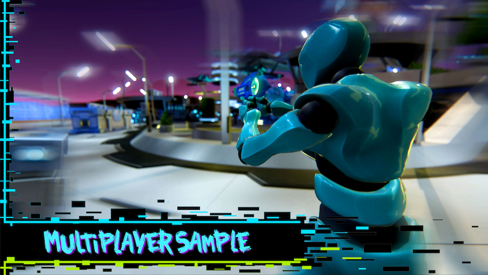

# MultiplayerSample Project



The MultiplayerSample Project is a third-person multiplayer game built on Open 3D Engine (O3DE), where robots battle one another for dominance in an under construction, multi-tiered starbase.

This version of the Multiplayer Sample Project uses O3DE's OpenParticleEngine and O3DE's miniaudio plugins for particle effects and
sound effects.  You can also switch to the branch `popcornfx-wwise` to get a version of this project that has support for WWISE
and PopcornFX, but you may have to downgrade your O3DE Engine version to a version where that support was last known working.

## Game overview

In this sample, players compete for the highest score to win. Over a series of rounds, players race around the starbase to collect gems and rack up points. Each player is armed with a laser pistol and protected by a shield. Taking damage from laser blasts depletes the player's shield. Once the shield is depleted, the player respawns at the cost of some of their collected gems.

Do you risk it all to win?

Game features:

* 3rd-person character setup
* Weapons (laser pistols) with a reticle, projectile, and visual effects
* Environmental dangers, including energy cannons and malfunctioning shield towers
* Jump pads to boost players high into the air
* A configurable number of rounds (default: 3 rounds)
* Configurable gem spawning patterns per round to drive player exploration
* Support for 1 to 10 players
* Rich sounds and visual effects support via the O3DE OpenParticleSystem and O3DE Miniaudio gems.
* Teleporters to aid player exploration and to demonstrate moving players.
* [User Settings screen](Documentation/SettingsScreen.md)
* Many points of extensibility

> A player can win the whole game early by reaching a score of 400. See the [Gameplay Configuration](Documentation/GamplayConfiguration.md) docs.

### Player controls

* Move using: **W,A,S,D**
* Speed toggle (sprint or walk): Tap **Shift**
* Jump: **Space**
* Look around: **Mouse drag**
* Fire primary weapon: **Left mouse button**
* See scoreboard: Hold **Tab**
* Open game menu: **Esc**
* Draw/holster active weapon: **E**

## Prerequisites

This repository uses **Git LFS** to store large binary files. A GitHub personal access token is required to authenticate with the Git LFS service. You can setup your personal access token and credential manager with the following steps:

1. Create a Git Personal Access Token. Your personal access token credentials are required for authentication when you clone the repository. For more information, refer to [Create a personal access token with the \'repo\' scope.](https://docs.github.com/en/github/authenticating-to-github/creating-a-personal-access-token)

2. Verify you have a [credential manager installed and configured](https://github.com/microsoft/Git-Credential-Manager-Core). Recent versions of Git install a credential manager so that your credentials are stored and supplied automatically when required.

## Conventions used in these instructions

These instructions use the following installation paths. Be sure to substitute your local installation paths:

* O3DE installation root (Where you installed or cloned O3DE from source)
  * `C:\o3de-repos\o3de`
* Location to download this repository and other related ones to:
   * `C:\o3de-projects` (Windows)
   * `~/o3de-projects` (Linux and others)

## Step 1: Getting the files

<span style="background-color:#4F3C3C">**NOTE:** You can clone the project to any local directory. If you clone the project inside an existing Git repository directory (for example, the directory that contains your local O3DE engine repository) you should add the o3de-multiplayersample project directory to the Git exclude file for the existing Git repository.</span>

### Clone the `o3de-multiplayersample` and `o3de-multiplayersample-assets` repositories

1. In a terminal, `cd` to the local directory where you'd like to clone the project, creating it if it doesn't exist:

   Windows:
   ```shell
   mkdir C:\o3de-projects
   cd C:\o3de-projects
   ```

   Linux/Others:
   ```shell
   mkdir ~/o3de-projects
   cd ~/o3de-projects
   ```

2. Clone the project.  This command is the same on all operating systems and will produce a subfolder called `o3de-multiplayersample`
   ```shell
   git clone https://github.com/o3de/o3de-multiplayersample.git
   Cloning into 'o3de-multiplayersample'...
   ```

3. Clone the assets. In this example the assets are cloned beside the multiplayersample project.  This command is the same on all operating systems and will produce a subfolder called `o3de-multiplayersample-assets`

   ```shell
   git clone https://github.com/o3de/o3de-multiplayersample-assets.git
   Cloning into 'o3de-multiplayersample-assets'...
   ```

### Step 1a. Ensure your branches match

Before building the project, ensure that O3DE itself, `o3de-multiplayersample` and `o3de-multiplayersample-assets` are all using the same version. For example, if you are using the **development** branch of the engine itself (O3DE), then ensure that you check out the **development** branches of `o3de-multiplayersample`, and `o3de-multiplayersample-assets` as well.

So for example, if you installed O3DE v2510.2, you can check for a compatible version here
* https://github.com/o3de/o3de-multiplayersample/tags - notice 2510.2
* https://github.com/o3de/o3de-multiplayersample-assets/tags  also 2510.2

In each of the repositories, you can do a `git checkout tags/<tag>` command to make sure your workspace is populated with the files from that particular tag (or use your favorite git UI to do the same thing):

These commands are the same on all operating systems.  They enter each folder, and make sure that the appropriate tag is checked out, then go back up to the base folder again.

```shell
cd o3de-multiplayersample
git checkout tags/2510.2
cd ..

cd o3de-multiplayersample-assets
git checkout tags/2510.2
cd ..
```

### Step 1b. Verify you have the LFS files.

Verify that you have all the files from the LFS endpoint  These commands are the same on every operating system, and enter each sub-folder, execute the `git lfs pull` command and then leave the subfolder.

```shell
cd o3de-multiplayersample
git lfs pull
cd ..

cd o3de-multiplayersample-assets
git lfs pull
cd ..
```

If using your own fork, complete LFS setup by updating the [LFS Url](https://www.o3de.org/docs/welcome-guide/setup/setup-from-github/#fork-and-clone). 

If you have problems with working with LFS, see the troubleshooting guide: https://github.com/o3de/o3de/wiki/Git-LFS-Troubleshooting.

## Step 2: Register the engine, the project, and the Gems
Since we installed the assets and the projects in an arbitrary location of your choice (`c:\o3de-projects` or `~/o3de-projects` in the above example),
we need to tell the engine where they are located ("Register them") so that it can find them during build and configure.

You can do this manually using the Project Manager GUI (click 'add existing' project, 'add existing' gem) over and over for each gem or project you wish
to register, but in this case, since there are a lot of them, its quicker to use the CLI tool to do this for you.  The O3DE CLI tool lives wherever you installed
O3DE to (so for example, `C:\O3DE\2510.2` if you used the v2510.2 installer, or `c:\o3de-repos\o3de` if you checked the code out there.)  It lives in a subfolder
called `scripts` and is called `o3de` on Windows, `o3de.sh` on others.

### Commands:

<span style="background-color:#4F3C3C">**NOTE:** The following steps only need to be performed once.</span>

Register the multiplayer sample asset gems (`--all-gems-path` option) and the project itself (`-p` option)

#### Windows:
   ```shell
   (PATH TO O3DE ENGINE)\scripts\o3de register --all-gems-path C:\o3de-projects\o3de-multiplayersample-assets\Gems
   (PATH TO O3DE ENGINE)\scripts\o3de register -p C:\o3de-projects\o3de-multiplayersample
   ```
#### Linux and Others
   ```shell
   (PATH TO O3DE ENGINE)/scripts/o3de.sh register --all-gems-path ~/o3de-projects/o3de-multiplayersample-assets/Gems
   (PATH TO O3DE ENGINE)/scripts/o3de.sh register -p ~/o3de-projects/o3de-multiplayersample
   ```

## Step 3: Build the project

### Option 1: Configure and Build using the Project Manager GUI

If you've already built the O3DE engine, or downloaded the installer, you can use the O3DE project manager to open and build the project

1. Run `o3de.exe`. If you used the engine build instructions from the [Getting Started](https://www.o3de.org/docs/welcome-guide/) guide, `o3de.exe` can be found at `C:/o3de/build/windows/bin/profile/o3de.exe`.   If you installed it via an installer package, it will be a shortcut on your desktop or your application menu ("O3DE Project Manager").

1. You can choose **Build** in Project Manager to build the project, and skip the following **Option 2: Configure and build using CLI** step which does the same thing (and results in the same files being created in the same locations).

### Option 2: Configure and build using CLI

This command outputs all the project binaries in the project's build directory (for example `c:/my-o3de-projects/o3de-multiplayersample/build`).

1. Configure command (Run from within the projects folder, ie, `c:\my-o3de-projects\o3de-multiplayersample`)

   #### Windows:
   ```shell
   cmake -S . -B build/windows
   ```
   Once you've done the above, projects will be created in the build/windows sub folder that you can open with Visual Studio.
   You don't need to use the CLI at this point - you can open that solution file, change the config to `profile` and set the Editor
   as your startup project, and just hit "Build and run".  Alternatively, you can continue with step 2 below to build it from the
   command line.  The result is the same.

   #### Linux / Others:
   ```shell
   cmake -S . -B build/linux -G "Ninja Multi-Config"
   ```

2. Building it from the command line:
   #### Windows:
   ```shell
   cmake --build build/windows --target Editor --target MultiplayerSample.GameLauncher MultiplayerSample.ServerLauncher --config profile -- /m
   ```
   binary files will be output into `build/windows/bin/profile`.

   #### Linux/Others:
   ```shell
   cmake --build build/linux --target Editor --target MultiplayerSample.GameLauncher MultiplayerSample.ServerLauncher --config profile
   ```
   Binary files will be output in `build/linux/bin/profile`.

   > **Note (Linux, headless / launcher-only builds):** if you're building only launcher targets without `Editor` (e.g. on a CI runner with no graphical environment), also add `--target MultiplayerSample` to the command. The Editor's `Tools` alias normally pulls in the bare `MultiplayerSample` gem variant, which AssetProcessor needs at bake time for BehaviorContext (otherwise `.scriptcanvas` bakes referencing MultiplayerSample components fail with "Failed to load dynamic library at path libMultiplayerSample.so"). Building the Editor brings it in implicitly; headless builds need to ask for it explicitly.

## Step 4: Run The Project

MultiplayerSampleProject is a multiplayer game, and this means there are several options to launch it.
Namely:
* You can launch the Editor and open a level like NewStarBase. Clicking the 'play' button (CTRL+G) will automatically launch a server in the background and connect to it as a client  This is the quickest way to see the game running.
* You can launch a headless ('dedicated') or graphics enabled (spectator) server and then connect clients to it.  This is more how players would run your game once shipped.

### Running the project by Launching it in the Editor

#### Option 1:  Use the project manager (O3DE)
If you installed O3DE via the installer, you can open the Editor from the O3DE project manager directly after building, by clicking the "Open Editor" button.

#### Option 2:  (Visual studio, Windows)
If you open the generated solution files from the build/windows subfolder, select Editor as your startup project, and `profile` as your configuration, then hit built and run, the editor will start.

#### Option 3:  (Linux / Manually using CLI)
If you want to do this manually using a CLI, you need to find the editor binary (`Editor.exe` on windows, `Editor` on linux/others).

Note that the editor binary will either be in your project's `build/windows/bin/profile` (or `build/linux/bin/profile` on Linux/others), 
if you are building O3DE from source code, or will be in the place you installed o3de, for example, on windows this might be something
like `C:\O3DE\25.10\bin\windows\profile\default\editor.exe`

Either way, you would pass the `--project-path` command line option to tell it where your project is, so for example, a full command
line on windows might look like `c:\O3DE\25.10\bin\windows\profile\default\editor.exe --project-path=c:\o3de-projects\o3de-multiplayersample`.
Alternatively, if Editor binary is already located within your project folder, you can just run it from there without any command line
arguments (double click on it or run it where it is from the CLI).

By default, launching a local server from the editor during **Play Mode** is enabled. To disable this behavior, update the `editorsv_enabled` value in the `editor.cfg` file to `false`.

Refer to the O3DE document [Test Multiplayer Games in the O3DE Editor](https://o3de.org/docs/user-guide/gems/reference/multiplayer/multiplayer-gem/test-in-editor/) for the complete list of console variables (CVARs) which support play in O3DE Editor with servers.

### Running the project by launching a standalone server and client

Under project root, there are two files: `launch_client.cfg` and `launch_server.cfg`.

1. `launch_client.cfg` contains the client connection setting. To connect to a server that is running locally, add the following line:

   ```shell
   connect
   ```

   To connect to a remote server, add the IP address of the server after the connect statement. For example:

   ```shell
   connect 192.168.0.20
   ```

2. `launch_server.cfg` contains the initial level to load:

   ```shell
   LoadLevel Levels/NewStarbase/NewStarbase.spawnable
   ```

#### Launching a standalone server

##### Option #1 - Launch the server with arguments

The server launcher can be run with the following command:

```shell
build\windows\bin\profile\MultiplayerSample.ServerLauncher.exe --console-command-file=launch_server.cfg 
```

Note that the `launch_server.cfg` configuration file is passed with the `--console-command-file` argument.

#### Option #2 - Launch the server from a command file

Alternatively, you can run `launch_server.cmd` (Windows) or `launch_server.sh` (Unix) which includes the `--console-command-file` argument.

```shell
launch_server.cmd 
```

#### Option #3 - Launch a headless server

If you do not need to see rendered output on your server, you can reduce resource usage by launching a headless server that uses the null renderer.

<span style="background-color:#4F3C3C">**NOTE:** Parameters to use null renderer must be passed on the command line as the console-command-file is parsed after rendering is configured.</span>

For each of the above options (#1, #2, #3) you will need to then connect to the server with the client, in order to play, see Step 6.

```shell
build\windows\bin\profile\MultiplayerSample.ServerLauncher.exe --console-command-file=launch_server.cfg -rhi=null -NullRenderer
```

#### Option #4 - Launch the server in O3DE Editor

### Launch the Client and connect to a server

#### Option #1 - Launch the client with arguments

The client launcher can be run with the following command:

```shell
build\windows\bin\profile\MultiplayerSample.GameLauncher.exe --console-command-file=launch_client.cfg
```

This command starts the client and connects to the server specified in `launch_client.cfg`.

#### Option #2 - Launch the client from a command file

Alternatively, you can run `launch_client.cmd` (Windows) or `launch_client.sh` (Unix) which includes the `--console-command-file` argument.

```shell
launch_client.cmd 
```

## Debugging in an IDE

When you debug `MultiplayerSample.GameLauncher` and `MultiplayerSample.ServerLauncher` from an IDE like Visual Studio, it's helpful to automatically host and connect so that you don't need to open the console (**~**) and explicitly execute the `host` and `loadlevel` commands on server, or the `connect` command on client.

For convenience, `Gem/Code/CMakeLists.txt` defines `ADDITIONAL_VS_DEBUGGER_COMMAND_ARGUMENTS` which allow Visual Studio to automatically populate the debugger with command arguments.

By default, `launch_client.cfg` is used when debugging the GameLauncher and `launch_server.cfg` is used when debugging the ServerLauncher.

When debugging set `net_UdpTimeoutConnections` to false. This prevents connection closures when stopped on breakpoints.

## Levels in this Project

This project ships with several levels, the ones of note are:

1. `NewStarBase` - The main game level (the default level for gameplay).
2. `StartMenu` - An example menu to join, host, and connect to servers.
3. `GamePlayTest` - Everything needed for gameplay, but in a tiny, fast-loading level. All game objects (Gems, HUD, and so on) are included.
4. `MultiplayerScriptingSample` - An example of scripts for Multiplayer.

Other levels in the project are used for testing or performance evaluation purposes and are considered experimental.

## How to contribute?

This sample is managed by the O3DE special interest group (SIG), [SIG/Network](https://github.com/o3de/sig-network).

O3DE cannot work without the help and input from as many of its community members as possible. You do not need anyone’s permission to get involved and contribute to the project. The **#sig-network** channel on O3DE Discord is a great entry point to get involved.

You can contribute by [reporting issues and making feature requests](https://github.com/o3de/o3de-multiplayersample/issues/new/choose), [fix known issues](https://github.com/o3de/o3de-multiplayersample/issues), or tackle backlogged feature requests.

## Documentation

| Link                                                                             | Description                                                               |
|----------------------------------------------------------------------------------|---------------------------------------------------------------------------|
| [Release Notes](Documentation/ReleaseNotes.md)                                   | Release notes and known issues per major release                          |
| [Gameplay Configuration](Documentation/GamplayConfiguration.md)                  | How to adjust gameplay settings                                           |
| [SettingsScreen](Documentation/SettingsScreen.md)                                | How to use and extend the settings screen                                 |
| [Packaging MPS](Documentation/PackedAssetBuilds.md)                              | How to build and package MPS for distribution or running servers remotely |
| [GameLift Setup](MPSGameLift/README.md)                                          | How to enable AWS GameLift integration                                    |

## O3DE Useful Links

* [O3DE Networking](https://o3de.org/docs/user-guide/networking/)
* [Multiplayer Tutorials](https://o3de.org/docs/learning-guide/tutorials/multiplayer/)
* [Networking/Multiplayer Settings](https://www.o3de.org/docs/user-guide/networking/settings/)

## License

For terms please see the LICENSE*.TXT files included in the root of this distribution.
